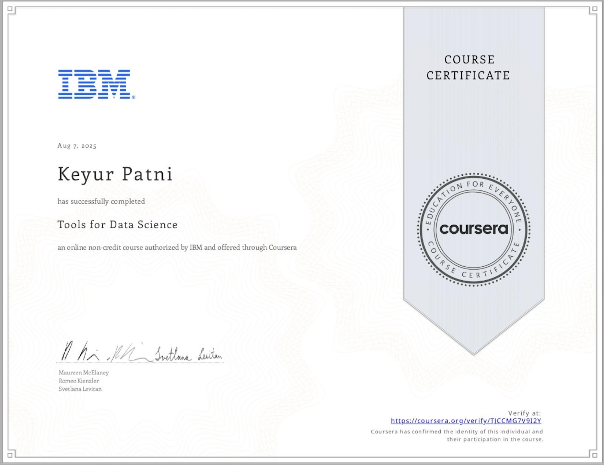
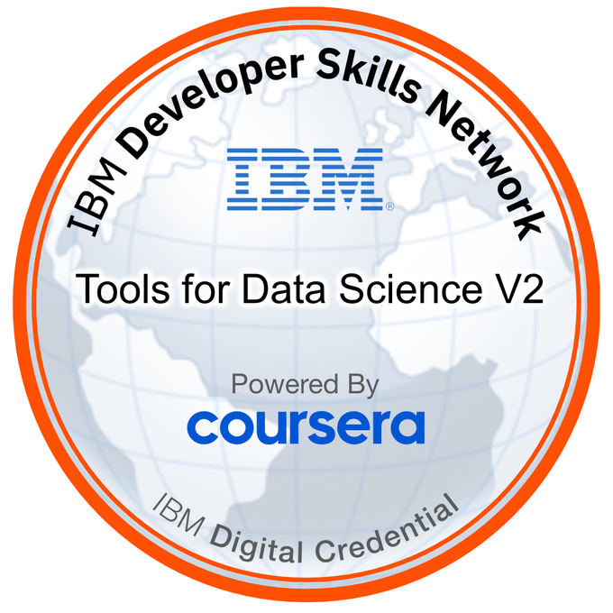

# Course 2: Tools for Data Science

Different types and categories of tools that data scientists use and popular examples of each.

Open Source, Cloud-based, and Commercial options for data science tools.

Data Management Tools: include Relational Databases, NoSQL Databases, and Big Data platforms:

MySQL, and PostgreSQL are examples of Open Source Relational Database Management Systems (RDBMS), and IBM Db2 and SQL Server are examples of commercial RDBMSes and are also available as Cloud services.
MongoDB and Apache Cassandra are examples of NoSQL databases.
Apache Hadoop and Apache Spark are used for Big Data analytics.
Data Integration and Transformation Tools: include Apache Airflow and Apache Kafka.

Data Visualization Tools: include commercial offerings such as Cognos Analytics, Tableau and PowerBI and can be used for building dynamic and interactive dashboards.

Code Asset Management Tools: Git is an essential code asset management tool. GitHub is a popular web-based platform for storing and managing source code. Its features make it an ideal tool for collaborative software development, including version control, issue tracking, and project management.

Development Environments: Popular development environments for Data Science include Jupyter Notebooks and RStudio.

Jupyter Notebooks provides an interactive environment for creating and sharing code, descriptive text, data visualizations, and other computational artifacts in a web-browser based interface.
RStudio is an integrated development environment (IDE) designed specifically for working with the R programming language, which is a popular tool for statistical computing and data analysis.

## ✅ Summary

This course provided an overview of popular tools used in data science, including open-source tools, cloud-based services, and integrated development environments (IDEs). It also introduced Jupyter Notebooks and covered essential skills for navigating and working within them.

---

## 📂 Small Assignments

[Getting Started with Jupyter Notebooks](../2%20Tools%20for%20Data%20Science/Getting%20Started%20with%20Jupyter%20Notebooks.ipynb)

[Using Markdown in Jupyter Notebooks](../2%20Tools%20for%20Data%20Science/Using%20Markdown%20in%20Jupyter%20Notebooks.ipynb)

[Working with Files in Jupyter Notebooks](../2%20Tools%20for%20Data%20Science/Working%20with%20Files%20in%20Jupyter%20Notebooks.ipynb)

---

## 🧪 Final Assignment

[Final Assignment: Data Science Ecosystem](../2%20Tools%20for%20Data%20Science/Data%20Science%20Ecosystem.ipynb)

---

## 🏆 Certificate & Badge

